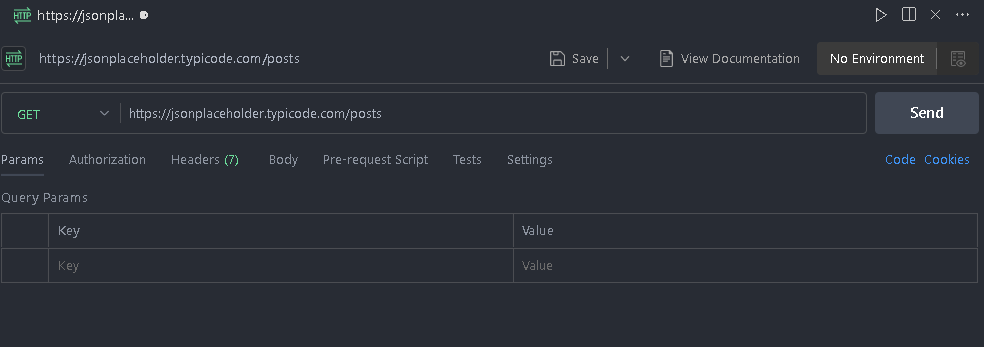
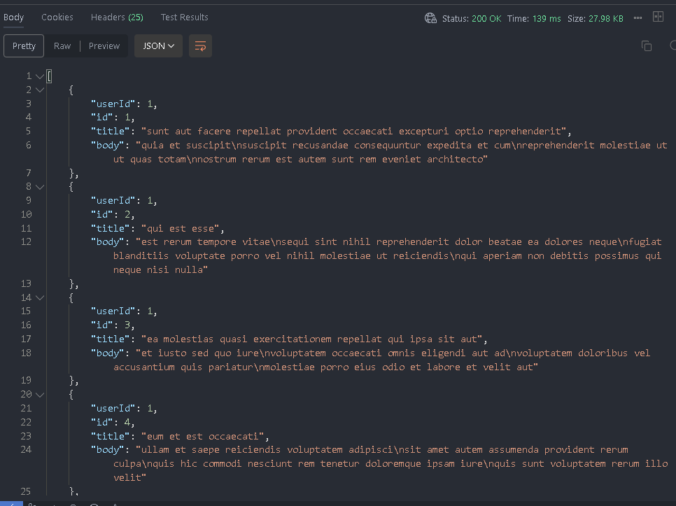
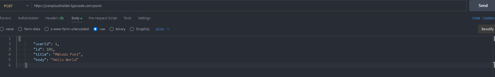
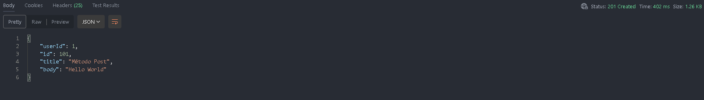
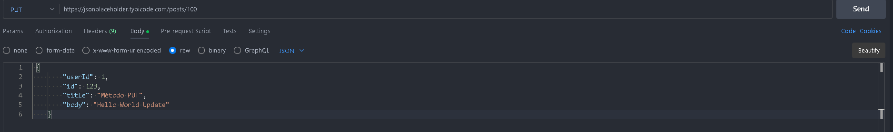
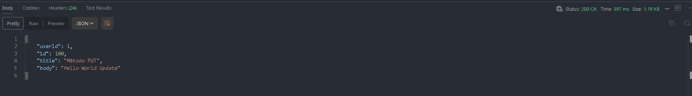
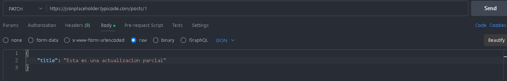
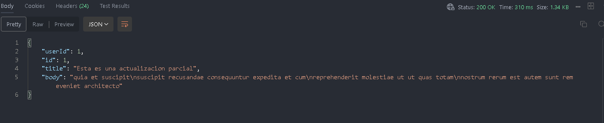
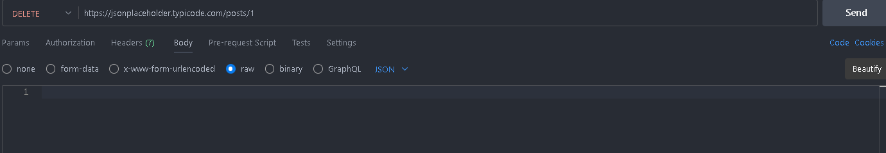
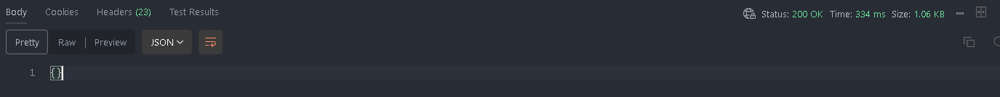

# Universidad de las Fuerzas Armadas ESPE

## Pullaguari Cedeño Axel Lenin / NRC:14956

### Peticiones HTTP:

Las peticiones o métodos dentro de los protocos de transferencias de hipertextos (HTTP) conforman un grupo de acciones que permiten dar instrucciones para diferentes tipos de recursos.

Dentro de la presente tarea se tomaran estos métodos y serán implementados con su respectiva documentación en este archivo. _Leer Readme_ para más información sobre los objetivos de esta tarea.

#### Métodos:

- _GET:_ El método GET solicita una representación de un recurso específico. Las peticiones que usan el método GET sólo deben recuperar datos.
- _HEAD:_ El método HEAD pide una respuesta idéntica a la de una petición GET, pero sin el cuerpo de la respuesta.
- _POST:_ El método POST se utiliza para enviar una entidad a un recurso en específico, causando a menudo un cambio en el estado o efectos secundarios en el servidor.
- _PUT:_ El modo PUT reemplaza todas las representaciones actuales del recurso de destino con la carga útil de la petición.
- _DELETE:_ El método DELETE borra un recurso en específico.
- _CONNECT:_ El método CONNECT establece un túnel hacia el servidor identificado por el recurso.
- _OPTIONS:_ El método OPTIONS es utilizado para describir las opciones de comunicación para el recurso de destino.
- _TRACE:_ El método TRACE realiza una prueba de bucle de retorno de mensaje a lo largo de la ruta al recurso de destino.
- _PATCH:_ El método PATCH es utilizado para aplicar modificaciones parciales a un recurso.

Para un mayor sustento haremos uso de una API ficticia proporcionada por [JSONPlaceholder](https://jsonplaceholder.typicode.com/guide/) y haciendo uso de su guía lo implementaremos mediante Postman y su extension de VS CODE 

Los métodos a ser implementados seran los siguientes:

| _Método_ |                 _Descripción_                 |
| :------- | :-------------------------------------------: |
| GET      |       Obtenga información de un recurso       |
| POST     |            Cree un nuevo recurso.             |
| PUT      | Actualice completamente un recurso existente. |
| PATCH    |  Actualice parcialmente un recurso existente  |
| DELETE   |         Elimine un recurso existente.         |

Siguiendo la guía proporciona por JSONPlaceholder y el uso de POSTMAN se detallan los resultados a continuación:

1. Dentro de la extensión de Postman para VS Code, debemos crear dentro de nuestro Workspace un _New HTTP Request_
2. En la nueva ventana procedemos a ingresar nuestro [link](https://jsonplaceholder.typicode.com/posts) de la API ficticia para poder solicitar nuestros métodos.

#### Método GET

- Seleccionar el método _GET_ de nuestro panel y dar click en el botón _SEND_
  
  Como se puede ver en la siguiente imagen.
- La información obtenida es mostrada en formato _Json_ y se obtiene todos los elementos. _Nota:_ Podemos especificar si deseamos solo un elemento de la Api y obtenerlo con nuestro método GET
  

_Análisis:_ Como podemos observar dentro del Status de nuestra petición nos aroja el código _200:_ _La solicitud ha tenido éxito. La información devuelta con la respuesta depende del método utilizado en la solicitud._

#### Método POST

- Seleccionar el método _POST_ de nuestro panel
- Seleccionar la opción de Body, la opción raw y escoger el formato JSON, procedemos a escribir nuestro elemento en JSON

---

`{
"userId":1,
"id":101,
"title":"Método Post",
"body":"Hello World"
}`

- Dar click en el botón _SEND_
  
  Como se puede ver en la siguiente imagen.
- La información obtenida es mostrada en formato _Json_ y se obtiene todos los elementos. _Nota:_ Podemos especificar si deseamos solo un elemento de la Api y obtenerlo con nuestro método POST
  

_Análisis:_ Como podemos observar dentro del Status de nuestra petición nos aroja el código _200:_ _La solicitud ha tenido éxito. La información devuelta con la respuesta depende del método utilizado en la solicitud._

#### Método PUT

- Seleccionar el método _PUT_ de nuestro panel y dar click en el botón _SEND_
  
  Como se puede ver en la siguiente imagen.
- La información obtenida es mostrada en formato _Json_ y se obtiene todos los elementos. _Nota:_ Podemos especificar si deseamos solo un elemento de la Api y obtenerlo con nuestro método PUT
  

_Análisis:_ Como podemos observar dentro del Status de nuestra petición nos aroja el código _200:_ _La solicitud ha tenido éxito. La información devuelta con la respuesta depende del método utilizado en la solicitud._

#### Método PATCH

- Seleccionar el método _PATCH_ de nuestro panel y dar click en el botón _SEND_
  
  Como se puede ver en la siguiente imagen.
- La información obtenida es mostrada en formato _Json_ y se obtiene todos los elementos. _Nota:_ Podemos especificar si deseamos solo un elemento de la Api y obtenerlo con nuestro método PATCH
  

_Análisis:_ Como podemos observar dentro del Status de nuestra petición nos aroja el código _200:_ _La solicitud ha tenido éxito. La información devuelta con la respuesta depende del método utilizado en la solicitud._

#### Método DELETE

- Seleccionar el método _DELETE_ de nuestro panel y dar click en el botón _SEND_
  
  Como se puede ver en la siguiente imagen.
- La información obtenida es mostrada en formato _Json_ y se obtiene todos los elementos. _Nota:_ Podemos especificar si deseamos solo un elemento de la Api y obtenerlo con nuestro método DELETE
  

_Análisis:_ Como podemos observar dentro del Status de nuestra petición nos aroja el código _200:_ _La solicitud ha tenido éxito. La información devuelta con la respuesta depende del método utilizado en la solicitud._

_Bibliografía:_

- Métodos de petición HTTP - HTTP | MDN. (2023, 24 julio). MDN Web Docs. _[Métodos HTTP](https://developer.mozilla.org/es/docs/Web/HTTP/Methods)_
